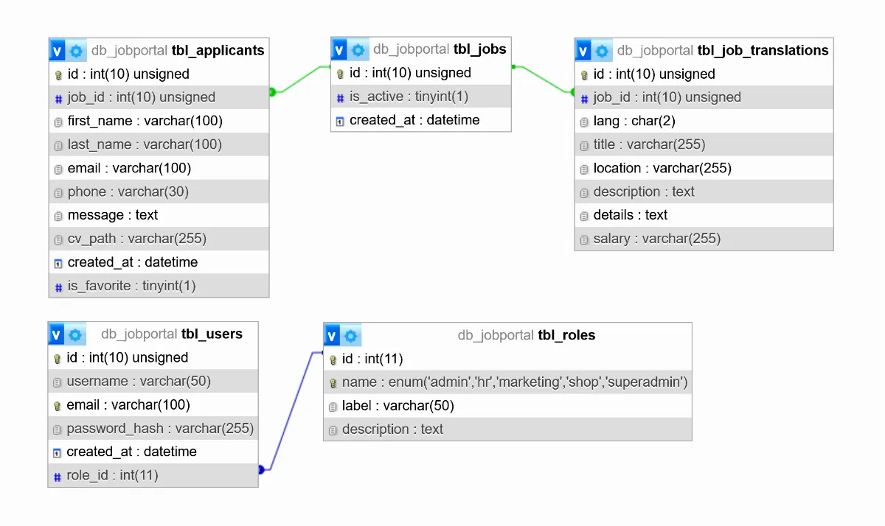

# JobPortal


JobPortal ist eine Fullstack-Bewerberplattform mit **Angular 20** (Frontend) und **PHP/MySQL** (Backend). Sie bietet ein **rollenbasiertes Dashboard** (Admin, HR), **Job- & Bewerberverwaltung**, ein **bewerberseitiges Formular mit CV-Upload**, **Dark/Light Mode**, **i18n** (UI‑Texte per TranslateModule sowie dynamische Inhalte aus der DB) und eine **responsive** UI mit mobiler, einklappbarer Sidebar für das Dashboard.

---

## Inhaltsverzeichnis

* [Projektstruktur](#projektstruktur)
* [Technologien](#technologien)
* [Datenbank](#datenbank)
* [Features](#features)
* [Installation & Setup](#installation--setup)
  * [Frontend](#frontend)
  * [Backend](#backend)
* [Demo](#demo)
* [Sicherheit](#sicherheit)
* [Lizenz](#lizenz)

---

## Projektstruktur

```
jobportal/
├── frontend/
|    └──jobportal/   # Angular 20 Projekt
└── backend/         # PHP/MySQL Backend
```

* Frontend und Backend werden im selben Repo gehalten, klar getrennte Ordner.
* Jeder Use‑Case hat einen eigenen Angular‑Service und einen passenden PHP‑Endpoint.

---

## Technologien

**Frontend**

* Angular 20
* Bootstrap 5
* Signals für lokale States
* Native Control Flow Directives(`@if`, `@for`)
* Lazy Loading für Feature‑Routes

**Backend**

* PHP 8
* PHP Mailer
* MySQL
* Generalisierte Endpoints (z. B. `toggle_entity.php`, `delete_entity.php`)
* Cronjob‑Script für Demo‑Reset
* Prepared Statements für DB‑Zugriffe

---

## Datenbank



---

## Features

### Admin / HR Dashboard

* Rollenbasiertes Dashboard (Admin, HR)
* Job‑Management: Erstellen, Bearbeiten, Löschen, Active‑Toggle (0/1)
* Bewerber‑Management:: Liste mit Detail‑Accordion, Favoriten‑Toggle (0/1)
* Benutzer‑Management:: Erstellen, Bearbeiten, Löschen, Rollenmanagement
* Sortierung (Datum, Titel, Ort, Gehalt, Email, Jobtitel, usw.) und clientseitige Pagination
* CV‑Download direkt aus der Bewerberliste
* Sidebar: Sortier‑ und Filtereinstellungen, Suchfeld, Buttons zum Jobs und Benutzer erstellen, Logout

### Bewerbungsbereich (public)

* Bewerbungsformular mit Datei‑Upload (CV)
* Client‑ und serverseitige Validierung
* reCAPTCHA‑Integration

### UX, i18n & Accessibility

* Dark / Light Mode
* i18n: UI‑Texte über Angular TranslateModule, dynamische Inhalte (z. B. Jobtitel/Beschreibungen) mehrsprachig aus der DB
* ARIA‑Attribute und keyboard‑friendly Controls
* Responsive Design, Dashboard Sidebar collapsible auf Mobile

---

## Installation & Setup

### Frontend

```bash
cd frontend/jobportal
npm install
ng serve
```

* Dev‑Server: `http://localhost:4200`
* `src/app/config/api.config.example.ts` und `src/app/config/recaptcha.config.example.ts` kopieren als `api.config.ts` und `recaptcha.config.ts` und Daten eintragen

### Backend

1. PHP‑Webserver einrichten (Apache / Nginx, PHP 8)
2. Datenbank anlegen und SQL‑Dump importieren (`db_jobportal.sql`)
3. `backend/api/config.inc.example.php` kopieren als `config.inc.php` und Daten eintragen
4. Backend‑Endpoints zb unter `backend/api/` bereitstellen

---

## Demo

* Demo‑Zugang möglich (Zugangsdaten auf Anfrage)
* Beispiel‑Jobs und Bewerber sind in der Demo Datenbank
* Cronjob setzt die Demo‑DB stündlich zurück (nur für Demo‑Zwecke)

[https://jobportal.andreas-web.dev]([https://jobportal.andreas-web.dev)

---

## Sicherheit

* Prepared Statements / parametrisierte Queries
* Server‑/Client‑Side Validierung für Formulare und Uploads
* Authguard im Frontend für geschützte Dashboard Routen

---

## Lizenz

Dieses Projekt ist proprietär. Siehe LICENSE.md für Details.